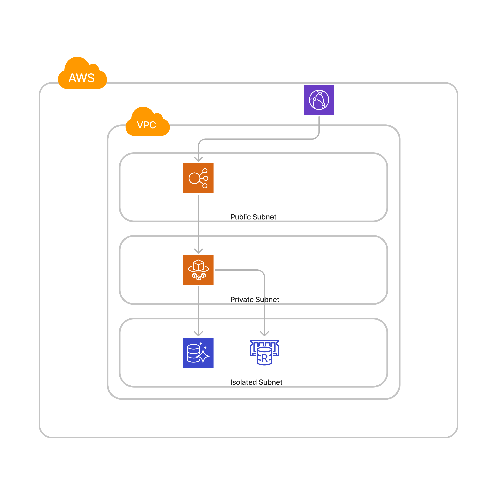

# Apache Superset on ECS Fargate

## This isn't complicated

Due to a lack of quality reference AWS architecture diagrams for running Superset, I took it upon myself to hammer out a very basic setup on AWS. The main goal was to remain as automated as possible with serverless/managed solutions.
You will probably need to adjust this for your needs, don't run this OOB in production unless you want to have a bad time.

Cloudfront is configured to respect Cache headers but should be tuned as necessary along with caching, memory, and all the usual things a competent engineer is capable of figuring out.

There are several Alarms with somewhat decent defaults, they do not go anywhere so configure the alarm target with a SNS topic with destinations (slack, opsgenie, etc.).

## Architecture

## Parameters

### Superset Stack

| Name               | Defaults            | Type    | Description                                                                 |
|--------------------|---------------------|---------|-----------------------------------------------------------------------------|
| envName            | -                   | String  | The environment name (e.g., development, staging, production)               |
| redisInstanceType  | cache.t4g.medium    | String  | The instance type for Redis                                                 |
| auroraInstanceType | t4g.large           | String  | The instance type for Aurora, without db. prefix                            |
| supersetMemoryLimit| 2048                | Number  | Memory Limit for Superset Service                                           |
| supersetCPU        | 1024                | Number  | CPU allocation for Superset Service                                         |
| r53DomainName      | none                | String  | (Optional) The Route53 DomainName to use for the CloudFront distribution    |
| ACMCertArn         | none                | String  | (Optional) The ACM certificate arn to use for the CloudFront distribution    |
| vpcIdParameter     | /base/network/vpcId | String  | The Parameter with VPC ID to use for the stack                              |
| ContainerImage     | -                   | String  | The container image to use for the Superset service                         |
| FirstRun           | false               | Boolean | If true, create the admin user and initialize the database                  |

### ACM Stack

| Name               | Defaults            | Type    | Description                                                                 |
|--------------------|---------------------|---------|-----------------------------------------------------------------------------|
| r53DomainName      | -                   | String  | The hosted zone name for the domain                                         |

## Launching

Build the superset container under `src` and push it to a (ECR) repository and provide the arn including tag in `ContainerImage`. 
There is the assumption that you have the VPCId stored in parameter store and so provide the parameter name. Set `envName` appropriately then diff, deploy, and pray.

## Bootsrapping

The `FirstRun` parameters controls if the following is done when set to True:

* Create a dedicated user for superset with the necessary permissions using the construct [cdk-rds-sql](https://github.com/berenddeboer/cdk-rds-sql).
* Adjusts the task command to create the admin user with the password admin.

After first launch, change this setting to false.

## SSL

We're doing some [cross-region magic](https://github.com/aws/aws-cdk/tree/8d55d864183803e2e6cfb3991edced7496eaadeb/packages/aws-cdk-lib#accessing-resources-in-a-different-stack-and-region) 
to create the ACM certificate for Cloudfront, the key piece to set is `r53DomainName` and the record is constructed with it.

If for whatever reason you can't do automatic ACM certificate creation with r53 dns validation, rip out the acmStack and do it the hard way.

## Shout Outs

* Anil Augustine Chalissery for his AWS in Plain English [post](https://aws.plainenglish.io/how-to-deploy-apache-superset-on-aws-ecs-08da76bedd32) that got me started.
